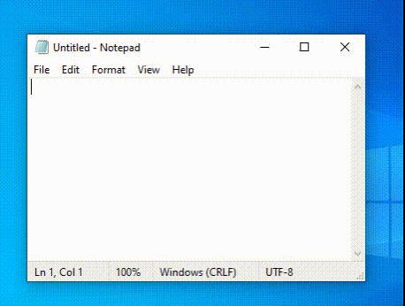
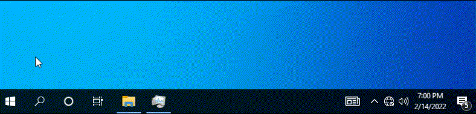

# WinAPI-Fun
> A collection of (relatively) harmless prank / virus examples using the Windows API

<br>

Pre-built binaries can be found in the [Releases](../../releases) section

To reset most examples, re-launch and kill the program again

<br>

| File                                               | Description                                                           |
| -------------------------------------------------- | --------------------------------------------------------------------- |
| [avoid.nim](src/avoid.nim)                         | The start button avoids mouse clicks by jumping around on the taskbar |
| [bsod.nim](src/bsod.nim)                           | Triggers a Blue Screen of Death                                       |
| [dripper.nim](src/dripper.nim)                     | Moves the current window down slightly every 10 seconds               |
| [highcontrast.nim](src/highcontrast.nim)           | Enable high contrast mode system-wide                                 |
| [intercept_space.nim](src/intercept_space.nim)     | Replaces space bar keypress with the word "space"                     |
| [mouse_button_swap.nim](src/mouse_button_swap.nim) | Swaps the left and right mouse buttons                                |
| [mouse_trails.nim](src/mouse_trails.nim)           | Creates a trail of mouse icons behind the cursor as it moves          |
| [mouse_trap.nim](src/mouse_trap.nim)               | Traps the mouse cursor in the top right corner for 60 seconds         |
| [random_capslock.nim](src/random_capslock.nim)     | Randomly toggle the Caps Lock every 0-30 seconds                      |
| [random_close.nim](src/random_close.nim)           | Randomly closes the current focussed window every 0-30 seconds        |
| [rotate.nim](src/rotate.nim)                       | Rotates the display 180 degrees                                       |
| [shake.nim](src/shake.nim)                         | Rapidly shakes the current focussed window                            |
| [start_disable.nim](src/start_disable.nim)         | Disables clicking the start button or taskbar                         |
| [start_popup.nim](src/start_popup.nim)             | Opens the start menu popup randomly every 0-60 seconds                |
| [stop_shutdown.nim](src/stop_shutdown.nim)         | Temporarily prevents a shutdown with a custom message                 |
| [time_local.nim](src/time_local.nim)               | Adds the message "HI" to the AM/PM localization string system-wide    |

<br>

## Compilation
[Install Nim](https://nim-lang.org/install_unix.html) and the [Winim](https://github.com/khchen/winim) library, then compile with the `--app:gui` flag

Note: if cross-compiling from Linux or macOS, also install the [mingw](https://www.mingw-w64.org/) toolchain and use the `-d:mingw` flag

```sh
nim c -d:mingw --app:gui src/avoid.nim
```

<br>

## Media

#### Shake



<br>

#### Avoid



<br> <br>

### USE AT YOUR OWN RISK
